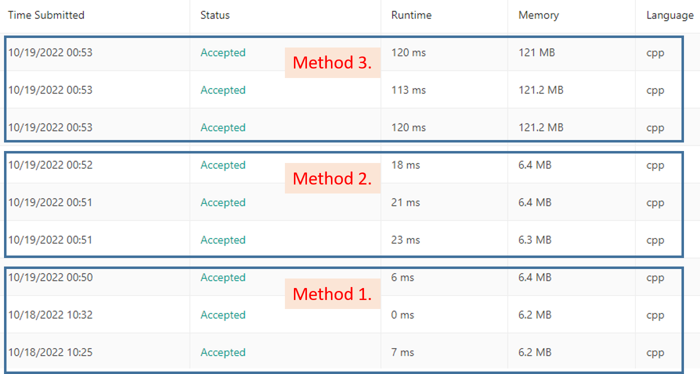

# 38. Count and Say

[Problem Link](https://leetcode.com/problems/count-and-say/)

## Solution

* 這一題的簡單來說就是用上一個結果遞迴下一個就好了<br>
  遞迴方式跟初始值都給好了，照做就能解題了
* 這題會被噴大概就是這題沒什麼學習意義吧，因為答案固定，建表也能解
* 但是這題不小心被我玩出另一個與演算法無關的效率問題了(?

## C++ std::string 字串拼接效率分析
事情是這樣的，下面三個方法都是在leetcode上跑出來的秒數，一開始我是用第三個方法，慢到起飛所以才來仔細思考這個問題。<br>

``` cpp
//std::string next, str;
//int same;
// 1. this way spend time: 0 ms
next +='0'+same;
next += str[s];
// 2. this way spend time: 7 ms
next += to_string(same) + str[s];
// 3. this way spend time: 121 ms
next = next + to_string(same) + str[s];
```


**以下內容都是根據結果進行的臆測，沒有跟組語對照過，所以存在理解錯誤的可能，因此不一定正確<br>
主要想說的是，數據一定是正確的，但我的解釋可能是錯的**
1.  string串接字元速度最快
2.  該式子的先後順序應該是右式先進行，做完之後為字串再與左式字串做連接，而字串串接字串的效率比字元略差，導致7ms的降速<br>
``` cpp
    next += to_string(same) + str[s];
->  next += combine_string;
```    
3.  右式計算效率沒有問題，但是在等於回左式時，左式會是以new一個記憶體的方式來承接字串，造成浪費記憶體與多消耗創建跟複製記憶體所需要的時間

一般方法->算法效率: O(n^2)<br>
建表查表->算法效率: O(1)<br>
